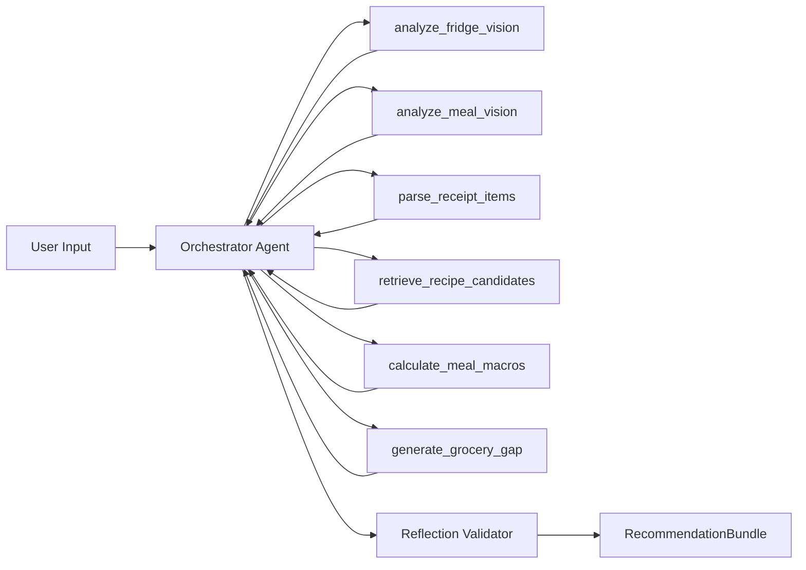

# Agent Specification (MVP)

> Implementation status: ADK runtime orchestration is implemented in `backend/app/agents/workflow.py` with deterministic fallback when ADK is disabled/unavailable.

## 1. Objective

Design an agentic backend that turns multimodal food context and user goals into actionable meal recommendations with automatic replanning.

Primary optimization targets:

- nutrition goal adherence
- spoilage reduction
- grocery cost minimization

## 2. ADK Agent Graph

Components:

- **Orchestrator**: manages step order and tool invocation strategy.
- **Tool adapters**: provider-specific wrappers with normalized I/O.
- **Reflection validator**: hard-constraint checker before final output.

## 3. Tool Contracts (MVP)

## 3.1 `analyze_fridge_vision(image_payload)`

Input:

- image uri/blob reference
- optional user locale

Output:

- detected ingredients list
- approximate quantity/unit
- confidence per ingredient
- spoilage risk hints (if available)

Failure mode:

- return structured parse error with retryable hint

## 3.2 `analyze_meal_vision(image_payload)`

Input:

- meal image reference

Output:

- detected dish label
- estimated portion size
- estimated calories/protein/carbs/fat

Failure mode:

- return uncertain classification with confidence threshold flag

## 3.3 `parse_receipt_items(image_payload)`

Input:

- receipt image reference

Output:

- normalized purchased item list
- optional quantity and price extraction

Failure mode:

- partial extraction accepted with low-confidence marker

## 3.4 `retrieve_recipe_candidates(query_constraints)`

Input:

- prioritized ingredients
- restriction/allergy rules
- macro and cook-time limits
- budget preference

Output:

- top-N candidate recipes with source metadata
- parsed fields include: `idMeal`, `strMeal`, `strCategory`, `strArea`, `strMealThumb`, `strYoutube`, `strSource`, and normalized `ingredient + measure` pairs

Failure mode:

- timeout/error response with fallback recommendation trigger

## 3.5 `calculate_meal_macros(recipe_ingredients)`

Input:

- candidate ingredient list with portions

Output:

- nutrition estimate object

Failure mode:

- low-confidence macro estimate flag

## 3.6 `generate_grocery_gap(recipe_ingredients, current_inventory)`

Input:

- selected recipe ingredients
- user inventory snapshot

Output:

- minimal missing ingredient list with reason

Failure mode:

- conservative list with uncertainty notes

## 4. Memory Policy

## 4.1 Short-Term Session State

Persist in active run context:

- latest user instruction deltas
- in-progress plan candidates
- temporary substitutions
- pending async job references

Retention:

- session lifetime or explicit reset

## 4.2 Long-Term Persisted State

Persist in database:

- user profile and goals
- historical meal logs
- pantry trajectory and receipt events
- recommendation history and feedback events

Retention:

- persistent by default with user delete/export controls (post-MVP hardening)

## 5. Reflection Policy

Hard checks before returning recommendation:

1. allergy and dietary restriction compliance
2. calorie/macro budget feasibility
3. spoilage-priority usage (when expiring ingredients exist)
4. ingredient availability with explicit grocery gap
5. plan feasibility under max cook-time

If validation fails:

- retry once with stricter filters
- if still failing, return safe fallback plan and explicit unmet-constraint explanation

## 6. Prompting and Guardrails

Prompt strategy:

- system prompt encodes optimization hierarchy and hard constraints.
- tool outputs are normalized to deterministic schema before reasoning.
- final answer must conform to `RecommendationBundle` schema.

Guardrails:

- never recommend known allergens from user profile.
- never hide uncertainty; surface confidence/fallback markers.
- avoid fabricated nutrition claims when tool confidence is low.

## 7. Safe Fallback Response

When tool failures block full optimization, return:

- one conservative recipe option
- explicit assumptions
- user action request (for example, confirm ingredient availability)
- suggestion to retry scan/replan

This keeps the user flow functional even under degraded provider conditions.
